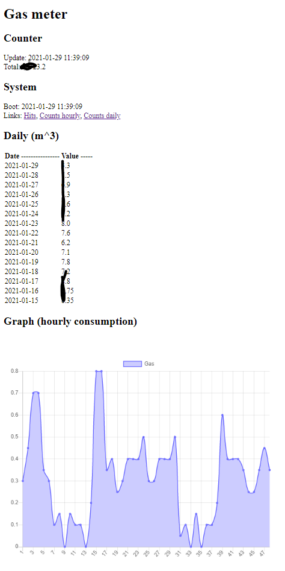

# esp32_python_gasmeter

As the name says, it is about simple, stable gasmeter readout on esp32 using micropython. It applies for gas meters with reed-type output.

## Requirements

You need following hardware:

+ ESP32 of almost any kind (I use https://www.amazon.de/AZDelivery-NodeMCU-Development-Nachfolgermodell-ESP8266/dp/B074RGW2VQ/)
+ reed sensor of probably any kind (I have https://www.amazon.de/gp/product/B07KTYW9DQ/)
+ some cables, usb charger for power
+ total cost expected 10 EUR

## Installation

+ flash micropython on esp32
  + this is easy, but you need to know how to do this
+ fill the secret_cfg.py file
+ fill the offset.py file
+ upload all files to esp32
  + not necesarily easy - I used webrepl, but it might require connecting to the esp32 through serial putty to connect to network
+ connect reed sensor to esp32
  + connect any power (3.3 or 5 V) from esp32 to reed
  + connect digital output from reed to pin 21 of esp32
+ place reed sensor in the sensor slot of the gas meter
+ done

## Functionality

This version includes:

+ web server running in thread, improved
+ web server showing total consumption (calculated current counter state)
+ web server showing daily consumption
+ hourly signal counting and consumption is available in the code
  + graph added, using chartist (delivering gzipped, around 10kb, acceptable size)
+ log file of signals (every valid signal is logged) (expected to overfill and destroy everything in 5 years :D, to be solved)
+ auto reset if webserver fails
+ saving the data (saving only hourly data - it is expected that the memory can hold 5+ years of data)
  + daily and total (and in future monthly ?) is recalculated from daily, so no errors expected
+ reset takes ~2-4 seconds, whereas magnet signal takes at shortest 15 seconds, so even during reboot, no signal should be lost

## Current GUI looks

No external hardware is needed for calculation or presentation, everything is included.
GUI is accessible through any webbrowser (computer, mobile, etc.).

Clearly the graph is hourly (last 48 hours) and list is daily, but it is easy to change.

## To Do

Additional idea is:

+ add mqtt connection
+ add graph on esp32 server (probably completely local chartjs graph) DONE

## Running on

Created and tested on
+ esp32-wroom-32 (from AZ-Delivery)
  + MAYBE esp8266 be possible, for lower power consumption, maybe battery run, but not sure how well micropython is running on it
+ KY-025 Reed Sensor
  + MAYBE some other sensors like simpler KY-021, or even a sensor tube without electronics might be used
  + probably KY-035 Hall sensor would be fine
  + even built-in in esp32 hall sensor might be fine (not tested, and it would require esp32 very near to the gasmeter)
+ micropython, esp32-idf4-20201114-unstable-v1.13-173-g61d1e4b01.bin (https://micropython.org/download/esp32/)

## Meter hardware

Gas meter info:

+ Schlumberger G4 RF1 (with 1 impulse per 0.1 m^3) 
  + impulse is sent on (magnet is near) between values x.x7 to x.x8 on the counter 
  + impulse is strong and clear, with shortest lifetime of 15 seconds 
  + due to this rule, impulse is counted (is valid) only if lasts 3-5 seconds (to avoid noise) 
  + this would need to be corrected for counters with higher resolution per impulse (still, the sensor is fast enough to handle it easily) 
+ would work with anything gas meter of this kind
+ presumably there are also water meters with this kind of output

## Connected projects

Connected projects

+ Chartist js
  + compressed js and css files are used for charts
  + https://github.com/gionkunz/chartist-js
+ Base for webserver in micropython
  + web server serving significantly improved, less memory usage
  + https://github.com/yunnanpl/esp32_python_web

## Similar projects

Similar projects/approaches for the same kind of meters, or other meters

+ gas - computer vision
  + https://github.com/michsvob/digit-recognition
  + https://github.com/ParalelniPolis/ppplyn
  + https://github.com/deviant-studio/energy-meter-scanner
    + different meter
+ gas - other method
  + https://github.com/RolandColored/smartmeter
    + the same gas and water meter as I have :)
+ power - computer vision
  + I solved mine with Shelly 3EM... with 1.02 calibration factor, it works perfectly ( get support from electrician ! )
  + https://github.com/spidgorny/energy-monitor
+ water
  + https://github.com/yamaton/water-meter-reading
+ other - photo
  + https://github.com/murdho/pi-read-meter
  
